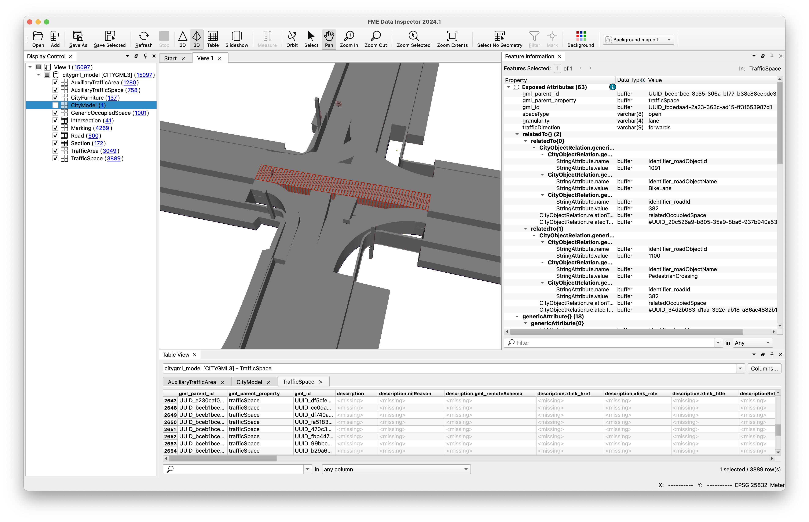
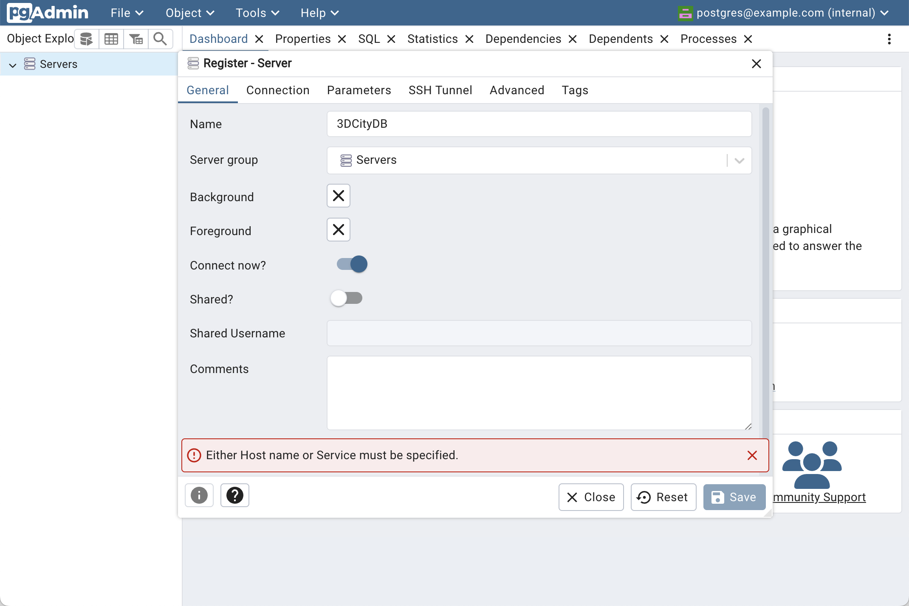
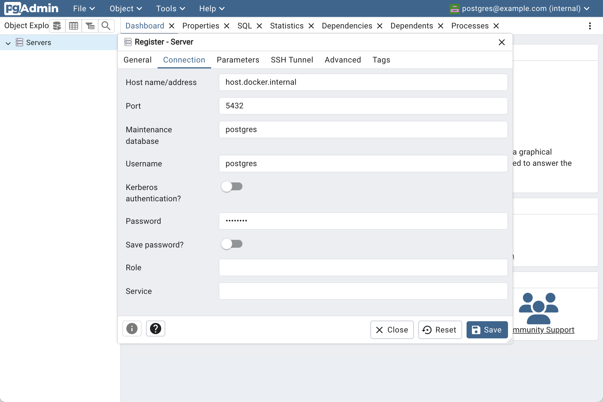
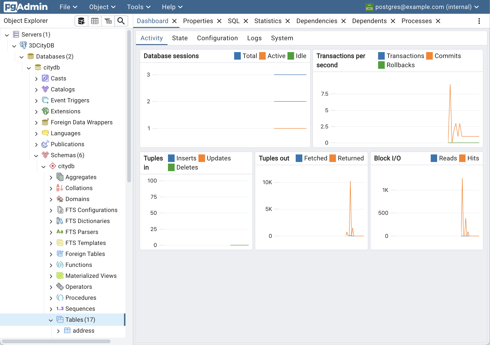
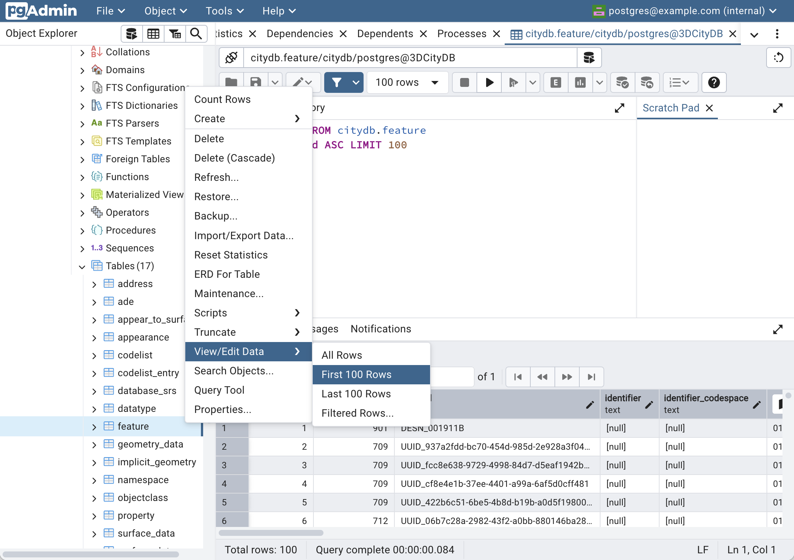
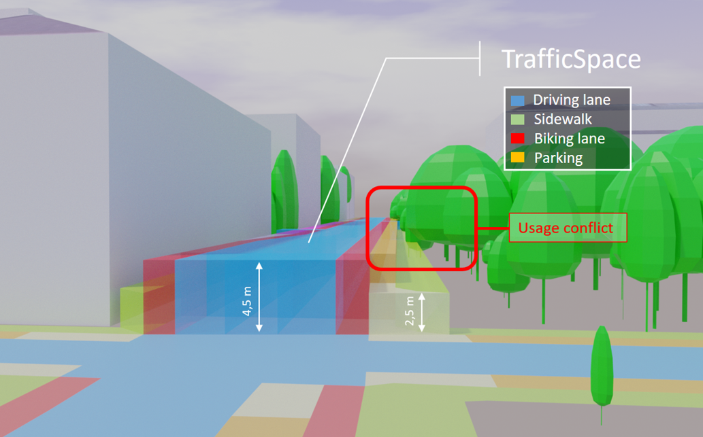
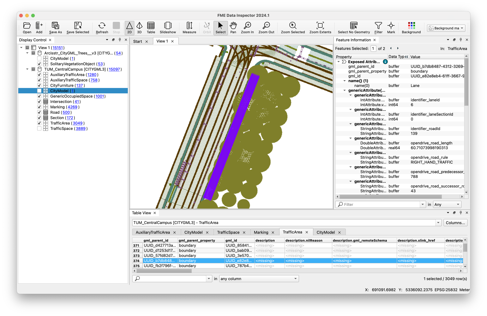

# CityGML 3.0 – Straßenraummodelle in der neuen 3D City Database

Diese Dokumentation dient als praktische Anleitung für den Workshop *CityGML 3.0 – Straßenraummodelle in der neuen 3D City Database* auf dem [22. Internationalen 3D Forum Lindau](http://www.3d-forum.li/).

## Vorraussetzung

Für die Anleitung wird in erster Linie eine [Docker-Installation](https://www.docker.com/) benötigt.
Um zu testen, ob die Installation von Docker erfolgreich war, kann der folgende Befehl ausgeführt werden:

```bash
docker run --rm hello-world
```

## Beispiel-Datensätze

Als Beispiel-Datensätze wird ein kleiner Bereich um die Technische Universität München verwendet, da hier LOD2-Gebäudemodelle vom [LDBV](https://geodaten.bayern.de/opengeodata/OpenDataDetail.html?pn=lod2), Vegetationsmodelle und ein OpenDRIVE-Datensatz im Rahmen des [TUM2TWIN-Projekts](https://tum2t.win/) zur Verfügung stehen.

Die Beispiel-Datensätze für diese Anleitung können unter folgendem Link heruntergeladen werden: [LRZ Sync+Share](https://syncandshare.lrz.de/getlink/fiD6g7NVHfUNWDpaVcV3LR/lindau-2025-datensaetze.zip).
Die Datensätze umfassen Gebäudemodelle in CityGML 2.0, Baummodelle in CityGML 2.0 und das Straßennetz als OpenDRIVE-Datensatz.

```bash
├── Baummodelle
│   └── Arcisstr_CityGML_Trees.gml
├── Gebaudemodelle
│   ├── 690_5334.gml
│   └── 690_5336.gml
└── Strassenraummodelle
    └── TUM_CentralCampus.xodr
```

Außerdem beinhaltet der Ordner bereits die nach CityGML 3.0 konvertierten Datensätze, damit die Konvertierungsschritte optional übersprungen werden können.

## Konvertierung der Gebäudemodelle von CityGML 2.0 nach 3.0

Die Migration von existierenden Gebäudemodellen in CityGML 2.0 zu Version 3.0 funktioniert mit dem Kommandozeilen-Werkzeug [citygml-tools](https://github.com/citygml4j/citygml-tools) mit folgendem Befehl:

```bash
docker run --rm -v /pfad/zu/Gebaudemodelle:/data citygml4j/citygml-tools upgrade "*.gml"
```

Wird ein Pfad zu einem Ordner angegeben, iteriert das Werkzeug rekursiv über alle CityGML-Datensätze und erstellt einen entsprechenden CityGML 3.0 Datensatz mit dem Suffix `__v3.gml`.

## Konvertierung der Baummodelle von CityGML 2.0 nach 3.0

Analog können die Baummodelle von CityGML 2.0 zu CityGML 3.0 konvertiert werden:

```bash
docker run --rm -v /pfad/zu/Baummodelle:/data citygml4j/citygml-tools upgrade "*.gml"
```

## Konvertierung Straßenraummodell

Mit dem Open-Source-Werkzeug [r:trån](https://rtron.io/) können OpenDRIVE-Datensätze nach CityGML 3.0 konvertiert werden.
Zuerst kann das Werkzeug geklont werden:

```bash
git clone git@github.com:tum-gis/rtron.git
cd rtron
```

Anschließend wird Kompilierung mit folgendem Befehl durchgeführt:

```bash
.\gradlew shadowJar
```

Mit folgendem Befehl kann abschließend der OpenDRIVE-Datensatz nach CityGML 3.0 konvertiert werden, wobei die Pfade zuerst angepasst werden müssen:

```bash
java -jar ./rtron-cli/build/libs/rrtron*.jar opendrive-to-citygml 
    --plan-view-geometry-distance-tolerance 10.0
    --plan-view-geometry-angle-tolerance 10.0
    --reproject-model
    --crs-epsg 25832
    --add-offset 0.0 0.0 514.92
    --compression-format NONE
    --remove-road-object-of-type TREE
    /pfad/zum/opendrive/ordner 
    /pfad/zum/citygml/ordner 
```

Der resultierende CityGML-3.0-Datensatz kann mit dem [FME Data Inspector](https://docs.safe.com/fme/html/FME-Form-Documentation/FME-Form/DataInspector/AboutTheDataInspector/FMEDataInspector_about.htm) geöffnet und inspiziert werden:



## 3D City Database

Die [3D City Database](https://github.com/3dcitydb/3dcitydb) ist eine Open-Source-Geodatenbank zur Speicherung, Repräsentation und Verwaltung von semantischen 3D-Stadtmodellen.
Die neue Version 5.0 unterstützt CityGML 3.0 und wurde am 17.03.2025 veröffentlicht.
Alle Details sind in der neuen [Dokumentation](https://3dcitydb.github.io/3dcitydb-mkdocs/) beschrieben.

### Inbetriebnahme der Datenbank

Die 3DCityDB kann als Docker-Container mit dem folgenden Befehl gestartet werden.

*Windows:*

```bash
docker run --name 3dcitydbv5 -p 5432:5432 -d `
    -v C:\pfad\zu\lokalen\postgres-data:/var/lib/postgresql/data `
    -e SRID=25832 `
    -e SRS_NAME="urn:adv:crs:ETRS89_UTM32*DE_DHHN2016_NH" `
    -e POSTGRES_DB=citydb `
    -e POSTGRES_USER=postgres `
    -e POSTGRES_PASSWORD=changeMe `
    -e PROJ_NETWORK=ON `
    -e POSTGIS_SFCGAL=true `
  3dcitydb/3dcitydb-pg
```

*Unix:*

```bash
docker run --name 3dcitydbv5 -p 5432:5432 -d \
    -v /pfad/zu/lokalen/postgres-data:/var/lib/postgresql/data \
    -e SRID=25832 \
    -e SRS_NAME="urn:adv:crs:ETRS89_UTM32*DE_DHHN2016_NH" \
    -e POSTGRES_DB=citydb \
    -e POSTGRES_USER=postgres \
    -e POSTGRES_PASSWORD=changeMe \
    -e PROJ_NETWORK=ON \
    -e POSTGIS_SFCGAL=true \
  3dcitydb/3dcitydb-pg
```

Erklärung der Argumente, welche in der [Dokumentation](https://3dcitydb.github.io/3dcitydb-mkdocs/3dcitydb/docker/#usage-and-configuration) beschrieben sind:

- `-v C:\pfad\zu\lokalen\postgres-data:/var/lib/postgresql/data`: Bindet das Daten-Volume in den Ordner `C:\pfad\zu\lokalen\postgres-data` auf dem Host-System zur Daten-Persistierung ein. Weitere Details finden sich in der [Dokumentation](https://github.com/docker-library/docs/blob/master/postgres/README.md#pgdata) zum PostgreSQL-Docker-Image.
- `-e SRID=25832`: [EPSG:25832](https://epsg.io/25832) als Koordinatenreferenzsystem
- `-e SRS_NAME="urn:adv:crs:ETRS89_UTM32*DE_DHHN2016_NH"`: Name des Koordinatenreferenzsystems
- `-e POSTGRES_DB=citydb`: Name der Datenbank
- `-e POSTGRES_USER=postgres`: Nutzername für die Datenbank
- `-e POSTGRES_PASSWORD=changeMe`: Passwort für den Nutzer
- `-e PROJ_NETWORK=ON`: Download der [PROJ-Netztransformationsgrids](https://proj.org/en/stable/usage/network.html#how-to-enable-network-capabilities), welche für einen Datumswechsel (z.B. WGS84->ETRS89) oder die Ableitung zu 3D Tiles (siehe [pg2b3dm](https://github.com/Geodan/pg2b3dm?tab=readme-ov-file#prerequisites)) benötigt werden
- `-e POSTGIS_SFCGAL=true`: [SFCGAL](https://sfcgal.gitlab.io/SFCGAL/) ist eine Bibliothek, welche für die Ausführung einiger [PostGIS-Funktionen](https://postgis.net/docs/reference_sfcgal.html) benötigt wird

## Import der CityGML-Datensätze

Der Import und Export von Datensätzen funktionieren mit dem Kommandozeilen-Werkzeug [citydb-tool](https://github.com/3dcitydb/citydb-tool).
Das Werkzeug unterstützt den Import und Export von CityGML v1.0 bis 3.0.
Für den Import von CityGML-Datensätzen ist folgender Befehl auszuführen.

*Windows:*

```bash
docker run --rm --net=host --name citydb-tool -i -t `
    -e CITYDB_HOST=localhost `
    -e CITYDB_PORT=5432 `
    -e CITYDB_NAME=citydb `
    -e CITYDB_USERNAME=postgres `
    -e CITYDB_PASSWORD=changeMe `
    -v C:\pfad\zu\lokalen\citygml\datensaetzen:/data `
  3dcitydb/citydb-tool import citygml citygml_datei.gml
```

*Unix:*

```bash
docker run --rm --net=host --name citydb-tool -i -t \
    -e CITYDB_HOST=localhost \
    -e CITYDB_PORT=5432 \
    -e CITYDB_NAME=citydb \
    -e CITYDB_USERNAME=postgres \
    -e CITYDB_PASSWORD=changeMe \
    -v /pfad/zu/lokalen/citygml/datensaetzen:/data \
  3dcitydb/citydb-tool import citygml citygml_datei.gml
```

Erklärung der Argumente, welche in der [Dokumentation](https://3dcitydb.github.io/3dcitydb-mkdocs/citydb-tool/docker/#environment-variables) beschrieben sind:

- `-e CITYDB_HOST=localhost`: Name des Hosts oder IP-Adresse, auf dem/der 3DCityDB ausgeführt wird
- `-e CITYDB_PORT=5432`: Port der 3DCityDB, mit dem eine Verbindung hergestellt werden soll
- `-e CITYDB_NAME=citydb`: Name der 3DCityDB-Datenbank, mit der eine Verbindung hergestellt werden soll
- `-e CITYDB_USERNAME=postgres`: Benutzername, der bei der Verbindung mit der 3DCityDB verwendet werden soll
- `-e CITYDB_PASSWORD=changeMe`: Passwort für die Verbindung zur 3DCityDB
- `-v C:\pfad\zu\lokalen\citygml\datensaetzen:/data`: Pfad zum lokalen Ordner, welcher die zu importierenden CityGML-Datensätze enthält

Statt einzelner CityGML-Dateien können auch Muster angegeben werden:

- `citygml_datei.gml`: Nur die einzelne Datei wird importiert
- `*.gml`: Alle GML-Dateien in dem Ordner werden importiert
- `*.zip`: Alle GML-Dateien in den ZIP-Archiven, welche in dem Ordner sind, werden importiert
- `**/*.gml`: Alle GML-Dateien in sämtlichen Unterordnern werde importiert
- `**/*.zip`: Alle GML-Dateien in den ZIP-Archiven in sämtlichen Unterordnern werden importiert

### Export der CityGML-Datensätze

Um das Stadtmodell anschließend wieder zu exportieren, kann analog der folgende Befehl ausgeführt werden:

*Windows:*

```bash
docker run --rm --net=host --name citydb-tool -i -t `
    -e CITYDB_HOST=localhost `
    -e CITYDB_PORT=5432 `
    -e CITYDB_NAME=citydb `
    -e CITYDB_USERNAME=postgres `
    -e CITYDB_PASSWORD=changeMe `
    -v C:\pfad\zu\lokalen\citygml\datensaetzen:/data `
  3dcitydb/citydb-tool export citygml --output citygml_datei.gml
```

*Unix:*

```bash
docker run --rm --net=host --name citydb-tool -i -t \
    -e CITYDB_HOST=localhost \
    -e CITYDB_PORT=5432 \
    -e CITYDB_NAME=citydb \
    -e CITYDB_USERNAME=postgres \
    -e CITYDB_PASSWORD=changeMe \
    -v /pfad/zu/lokalen/citygml/datensaetzen:/data \
  3dcitydb/citydb-tool export citygml --output citygml_datei.gml
```

> Mit dem zusätzlichen Argument ``--no-appearances`` können die Objekte ohne Texturen exportiert werden.

### Datenbank-Inspektion

Um eine 3DCityDB-Instanz zu inspizieren und zu verwalten, eignen sich Open-Source-Tools wie [pgAdmin](https://www.pgadmin.org) und [DBeaver](https://dbeaver.io/) sowie kommerzielle Alternativen wie [JetBrains DataGrip](https://www.jetbrains.com/datagrip/).
Insbesondere pgAdmin ist eine etablierte und webbasierte Anwendung, die sich problemlos mit einer laufenden PostgreSQL-Datenbankinstanz verbinden lässt und deren gesamten Inhalt zugänglich macht. Diese Software kann auch über Docker in Betrieb genommen werden:

*Windows:*

```bash
docker run --name pgadmin -p 8080:80 -d `
    -e PGADMIN_DEFAULT_EMAIL=postgres@example.com `
    -e PGADMIN_DEFAULT_PASSWORD=postgres ^
    -e PGADMIN_CONFIG_DATA_RESULT_ROWS_PER_PAGE=20000 ^
  dpage/pgadmin4
```

*Unix:*

```bash
docker run --name pgadmin -p 8080:80 -d \
    -e PGADMIN_DEFAULT_EMAIL=postgres@example.com \
    -e PGADMIN_DEFAULT_PASSWORD=postgres \
    -e PGADMIN_CONFIG_DATA_RESULT_ROWS_PER_PAGE=20000 \
  dpage/pgadmin4
```

Erklärung der [Argumente](https://www.pgadmin.org/docs/pgadmin4/8.13/container_deployment.html#environment-variables):

- `-e PGADMIN_DEFAULT_EMAIL=postgres@example.com`: E-Mail-Adresse, die bei der Einrichtung des ersten Administratorkontos für die Anmeldung bei pgAdmin verwendet wird.
- `-e PGADMIN_DEFAULT_PASSWORD=changeMe`: Dieses Passwort wird bei der Einrichtung des ersten Administratorkontos für die Anmeldung bei pgAdmin verwendet.
- `-e PGADMIN_CONFIG_DATA_RESULT_ROWS_PER_PAGE=20000`: Erhöht die Anzahl an Geometrien, welche in der 2D-Karte angezeigt werden können.

Sobald es gestartet ist, sollten über den Browser auf [http://localhost:8080](http://localhost:8080) darauf zugegriffen werden können.
Nach der Anmeldung mit den Benutzerdaten sollte sich ein neues Dialogfeld öffnen, wenn auf `Add new server` geklickt wird:





Die folgenden Angaben müssen eingegeben werden:

- Name: Der Name, unter dem der Server registriert werden soll, z. B. `3DCityDB`
- Host name/address: Der Hostname oder die IP, unter der die Datenbank ausgeführt wird, z.B. `host.docker.internal` falls diese lokal als Docker-Container ausgeführt wird
- Port: Der Port der Datenbank, z.B. `5432`
- Username: Der Benutzername für die Datenbank, z.B. `postgres`
- Password: Das Passwort für die Datenbank, z.B. `changeMe`

Nach der Verbindung zur 3DCityDB kann zu den 3DCityDB-Tabellen navigiert werden:



Eine Tabelle kann inspiziert werden, indem mit der rechten Maustaste auf den Tabellennamen geklickt und dann `View/Edit Data` -> `First 100 Rows` ausgewählt wird:



## SQL-Abfragen auf die 3D City Database

Um die TrafficArea-Objekte in 2D auf der Karte in pgAdmin zu visualisieren, kann der folgende SQL-Befehl ausgeführt werden:

```sql
SELECT ST_Transform(ST_Force2D(g.geometry), 4326), *
FROM citydb.feature f
LEFT JOIN objectclass o ON f.objectclass_id = o.id
JOIN geometry_data g ON f.id = g.feature_id
WHERE o.classname = 'TrafficArea';
```

Eine Visualisierung des TrafficArea-Objekts mit der GML ID `UUID_e82e8eb4-61ff-3667-93c5-4f39fea03c90` erfolgt über folgenden Befehl:

```sql
SELECT ST_Transform(ST_Force2D(g.geometry), 4326), *
FROM citydb.feature f
LEFT JOIN objectclass o ON f.objectclass_id = o.id
JOIN geometry_data g ON f.id = g.feature_id
WHERE o.classname = 'TrafficArea' AND f.objectid = 'UUID_e82e8eb4-61ff-3667-93c5-4f39fea03c90';
```

Des Flächeninhalts dieser TrafficArea kann mit folgendem Befehl berechnet werden:

```sql
SELECT ST_Area(g.geometry)
FROM citydb.feature f
LEFT JOIN objectclass o ON f.objectclass_id = o.id
JOIN geometry_data g ON f.id = g.feature_id
WHERE o.classname = 'TrafficArea' AND f.objectid = 'UUID_e82e8eb4-61ff-3667-93c5-4f39fea03c90';
```


*Volumetrische Repräsentationen der Verkehrsräume mit unterschiedlichen Höhen je nach Funktion (Bildquelle: [Road2CityGML3-Guideline](https://tum-gis.github.io/road2citygml3/guideline/guideline.html#trafficspaces-and-auxiliarytrafficspaces))*




Abfrage der Baum-Objekte, welche den TrafficSpace mit GML ID `UUID_b7db8487-4312-3269-9fa5-d7475f9a3c1b` schneiden:

```sql
WITH traffic_spaces AS (
    SELECT
        f.id AS feature_id,
        f.objectid AS objectid,
        g.geometry
    FROM citydb.feature f
    LEFT JOIN objectclass o ON f.objectclass_id = o.id
    JOIN geometry_data g ON f.id = g.feature_id
    WHERE o.classname = 'TrafficSpace'
        AND f.objectid = 'UUID_b7db8487-4312-3269-9fa5-d7475f9a3c1b'
        AND ST_GeometryType(g.geometry) = 'ST_PolyhedralSurface'
    LIMIT 10
),
vegetation_objects AS (
    SELECT
        f.id AS feature_id,
        f.objectid AS objectid,
        g.geometry
    FROM citydb.feature f
    LEFT JOIN objectclass o ON f.objectclass_id = o.id
    JOIN geometry_data g ON f.id = g.feature_id
    WHERE o.classname = 'SolitaryVegetationObject'
)
SELECT
    ts.feature_id AS trafficspace_id,
    ts.objectid AS trafficspace_objectid,
    svo.feature_id AS vegetation_id,
    svo.objectid AS vegetation_objectid,
    ts.geometry AS trafficspace_geom,
    svo.geometry AS vegetation_geom
FROM traffic_spaces ts
JOIN vegetation_objects svo
ON ST_3DIntersects(ts.geometry, svo.geometry);
```

## Weiterführendes Material

- CUT-Akademie
    - Andreas Donaubauer, Benedikt Schwab, Mathias Boedecker: [Leipzig in CityGML 3.0 – Pilot zur Migration des 3D-Stadtmodells Leipzig in CityGML 3.0](https://www.connectedurbantwins.de/wissenstransfer/cut-akademie/leipzig-in-citygml-3-0-pilot-zur-migration-des-3d-stadtmodells/)
    - Son Ngyuen und Felix Olbrich: [CityGML 3.0 – Neue Funktionen](https://www.connectedurbantwins.de/wissenstransfer/cut-akademie/citygml-3-0-neue-funktionen)
    - Son Ngyuen und Felix Olbrich: [CityGML und Graphen – Vorstellung von Anwendungen](https://www.connectedurbantwins.de/wissenstransfer/cut-akademie/citygml-und-graphen-vorstellung-von-anwendungen)
- Standard
    - [OGC CityGML 3.0](https://www.ogc.org/standards/citygml)
    - [Guideline zum CityGML 3.0 Transportation Modul](https://tum-gis.github.io/road2citygml3/)
- Software
    - [3D City Database v5](https://3dcitydb.github.io/3dcitydb-mkdocs)
    - [citygml-tools](https://github.com/citygml4j/citygml-tools)
    - [r:trån](https://github.com/tum-gis/rtron)
- Demos
    - Leipzig [3DCityDB-Web-Map-Client](https://tinyurl.com/2rmmm6wh)
    - Interaktive [Streetspace Demos](https://wiki.tum.de/display/gisproject/Online+Demo+Collection)
    - CityGML 3.0 Dynamizer [Demo für die Sonnenstraße in München](https://4dcity.gis.lrg.tum.de)
    - Downloads von weiteren [CityGML-Datensätzen](https://wiki.tum.de/display/gisproject/Download+Section)
